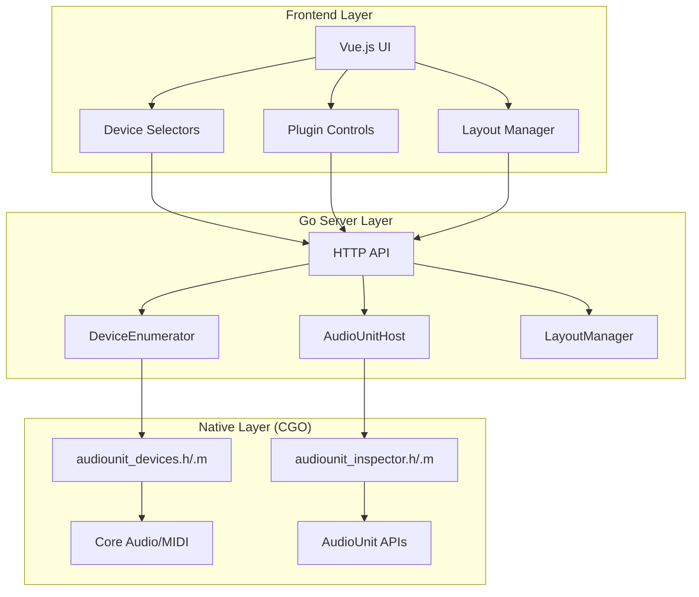

# MC-SoFX Controller - AI Context Document

*This document provides comprehensive context for AI assistants working on the MC-SoFX AudioUnit Controller project.*

**Last Updated**: July 30, 2025
**Current Status**: Component refactoring phase with active debugging of group rendering issues

## Project Overview

**MC-SoFX Controller** is a macOS application that provides web-based control interfaces for AudioUnit plugins, with comprehensive device enumeration and real-time parameter manipulation capabilities.

### Core Architecture



## Current Implementation Status

### ✅ **Completed Components**

#### 1. Device Enumeration System
- **Files**: `devices.go`, `audiounit_devices.h/.m`
- **Capabilities**: 
  - Real hardware discovery (audio: 21 devices, MIDI: 19 devices)
  - Capability detection (sample rates, bit depths, channel counts)
  - Core Audio and CoreMIDI integration
  - JSON API endpoints: `/api/devices/{audio|midi}/{input|output}`
- **Key Devices Detected**: KATANA (4ch), Steep II (2ch, up to 192kHz), iPhone mic, Samsung 6ch

#### 2. AudioUnit Plugin Introspection
- **Files**: `introspection.go`, `audiounit_inspector.h/.m`
- **Capabilities**:
  - Discovers 62 usable AudioUnit plugins from 157 total
  - Parameter extraction with types, ranges, metadata
  - Auto-generates control layouts from plugin parameters
  - Comprehensive plugin validation and filtering

#### 3. HTTP Server Foundation
- **Files**: `main.go`
- **Capabilities**:
  - RESTful API for device enumeration and plugin control
  - CGO integration with proper framework linking
  - Error handling and logging throughout
  - CORS support for frontend integration

#### 4. Frontend Foundation
- **Files**: `frontend/app.html`, `frontend/src/input.css`
- **Capabilities**:
  - Vue.js reactive UI with Tailwind CSS styling
  - Basic device selection interface
  - Plugin control layout rendering
  - Responsive design with mobile support

### ⚠️ **Partially Complete**

#### 1. Default Device Detection
- **Issue**: Currently returns hardcoded values in `getDefaultAudioDevices()`
- **Need**: Implement Core Audio `kAudioHardwarePropertyDefaultInputDevice/OutputDevice`
- **Impact**: Prevents intelligent device preselection

#### 2. Frontend Device Integration
- **Issue**: UI shows devices but doesn't use capability data for validation
- **Need**: Integrate device capabilities into selection logic
- **Impact**: Users can select incompatible device combinations

### ❌ **Not Implemented**

#### 1. AudioUnit Hosting
- **Scope**: Load plugins, configure audio chains, real-time parameter control
- **Architecture**: Needs new `audiounit_host.go` + `audiounit_host.h/.m` + `libaudiounit_host.a` following static library pattern
- **Dependency**: Requires completed device enumeration

#### 2. Real-time Parameter Control
- **Scope**: Frontend controls → HTTP API → AudioUnit parameter changes
- **Architecture**: WebSocket or Server-Sent Events for bidirectional sync
- **Dependency**: Requires AudioUnit hosting

## Current Issues & Debugging Status (July 30, 2025)

### 🚨 **Active Issues Requiring Resolution**

#### 1. Layout Editor Group Rendering Failure
- **Problem**: Groups only render in Layout Viewer, not in Layout Editor canvas
- **Symptoms**: 
  - "Add Group" button creates groups successfully (verified via debugging)
  - Groups appear in Layout Viewer panel correctly
  - Groups do not appear in Layout Editor canvas despite sharing LayoutCanvas component
  - Vue template compilation error was fixed (duplicate keys issue resolved)
- **Technical Details**:
  - LayoutCanvas component implemented with mode-based rendering ('editor' vs 'viewer')
  - Both modes use same group data and rendering methods
  - Debug panels show groups exist in data structure
  - Template keys made unique: 'editor-' + group.id vs 'viewer-' + group.id
- **Status**: Partially debugged, root cause still unknown
- **Impact**: Layout Editor is non-functional for group management

#### 2. Save Layout Server Error
- **Problem**: Save button fails with HTTP 500 Internal Server Error
- **Technical Details**:
  - Frontend sends POST to `/api/layouts/save` endpoint
  - Server responds with 500 error
  - Backend layout save implementation incomplete or broken
- **Status**: Not investigated
- **Impact**: No persistence of layout changes

### 🔧 **Recent Refactoring Work Completed**

#### Vue Component Architecture Improvements
- **PropertyInspector Component**: ✅ Extracted successfully
- **EditorToolbar Component**: ✅ Extracted successfully  
- **LayoutCanvas Component**: ✅ Extracted but rendering issues persist
- **Event System**: ✅ Component communication working properly
- **Debug Infrastructure**: ✅ Extensive logging and visual debug panels added

#### Code Quality Improvements
- **Template Organization**: Components properly separated into script templates
- **Event Flow**: Props/events pattern implemented correctly
- **State Management**: Unified selection model (selectedItem) partially implemented
- **Property Editing**: Live property updates working in PropertyInspector

### 🐛 **Debugging Trail**

#### Component Extraction Success
1. Successfully extracted PropertyInspector and EditorToolbar components
2. Event communication between components working correctly
3. Component registration and template binding functioning

#### Group Rendering Investigation
1. **Initial Problem**: "Add Group" appeared broken
2. **Discovery**: Groups were actually being created and showing in viewer
3. **Root Cause Hypothesis**: Duplicate rendering systems (viewer vs editor)
4. **Solution Attempt**: Created shared LayoutCanvas component
5. **Template Error**: Vue complained about duplicate keys in v-if branches
6. **Fix Applied**: Made keys unique with mode prefixes
7. **Current Status**: Template error resolved but groups still not showing in editor

#### Current Debugging State
- Debug panels show data is correct (layout exists, groups exist, not sample layout)
- Template conditions appear to be evaluating correctly
- Event flow from "Add Group" button working
- Vue force update calls being made
- No visible Vue errors in console after key fix

---

## Technical Architecture Patterns

### CGO Integration Architecture
**IMPORTANT**: This is NOT a package-based architecture to avoid Go recompilation issues. All files exist in the `main` package at the root level.

#### Native Code Integration Pattern
The project uses a **static library + header** pattern for each native functionality area:

```
devices.go                    ←→  audiounit_devices.h/.m → libaudiounit_devices.a
introspection.go             ←→  audiounit_inspector.h/.m → libaudiounit_inspector.a
[future] audiounit_host.go   ←→  audiounit_host.h/.m → libaudiounit_host.a
```

#### CGO Linking Mechanism
Each Go file includes CGO directives that link to the corresponding static library:

**devices.go**:
```go
/*
#cgo CFLAGS: -x objective-c
#cgo LDFLAGS: -framework Foundation -framework CoreAudio -framework AudioToolbox -framework CoreMIDI -framework AVFoundation
#include "audiounit_devices.h"
#include <stdlib.h>
*/
```

**introspection.go**:
```go
/*
#cgo CFLAGS: -x objective-c -DVERBOSE_LOGGING=0
#cgo LDFLAGS: -L. -laudiounit_inspector -lobjc -framework Foundation -framework AudioToolbox -framework AVFoundation -framework AudioUnit
#include <stdlib.h>
#include "audiounit_inspector.h"
*/
```

#### Key Differences Between Files
1. **devices.go**: Links directly to frameworks (no static library reference)
2. **introspection.go**: Links to pre-built static library (`-laudiounit_inspector`) plus frameworks
3. **Header files**: Minimal C function declarations (e.g., `char *IntrospectAudioUnits(void);`)
4. **Implementation files**: Full Objective-C implementation with Core Audio/AudioUnit APIs

#### Static Library Build Process
- **Object files**: `.m` files compiled to `.o` (e.g., `audiounit_inspector.o`)
- **Static libraries**: `.o` files archived to `.a` (e.g., `libaudiounit_inspector.a`)
- **Build location**: Libraries exist at project root, referenced by `-L.` in LDFLAGS
- **No package isolation**: Everything in `main` package to avoid Go module/package recompilation issues

### JSON Interface Strategy
- **Go ↔ C Communication**: Complex data structures passed as JSON strings
- **Benefits**: Avoids CGO marshaling complexity, easier debugging
- **Pattern**: C functions return `char*` JSON, Go unmarshals to structs
- **Memory Management**: Go code must `C.free()` returned C strings

### Device Capability Model
```go
type AudioDevice struct {
    Name                 string    `json:"name"`
    UID                  string    `json:"uid"`
    DeviceID             int       `json:"deviceId"`
    ChannelCount         int       `json:"channelCount"`
    SupportedSampleRates []float64 `json:"supportedSampleRates"`
    SupportedBitDepths   []int     `json:"supportedBitDepths"`
    IsDefault            bool      `json:"isDefault"`
}
```

## Common Development Tasks

### Adding New Native Functionality
1. **Create header file**: `new_feature.h` with minimal C function declarations
2. **Implement Objective-C**: `new_feature.m` with full Core Audio/AudioUnit APIs implementation
3. **Build static library**: 
   - Compile: `clang -x objective-c -c new_feature.m -o new_feature.o`
   - Archive: `ar rcs libnew_feature.a new_feature.o`
4. **Create Go interface**: `new_feature.go` in main package with CGO LDFLAGS linking to static library
5. **Add HTTP endpoints**: Integrate into `main.go` server routes
6. **Update documentation**: Add to architecture diagrams

### CGO Static Library Pattern
- **Compilation**: Each `.m` file compiles to `.o` object file
- **Archiving**: Object files archived into `.a` static libraries at project root
- **Linking**: Go CGO LDFLAGS reference libraries with `-L. -llibraryname`
- **Benefits**: Avoids Go package recompilation issues, cleaner build process

### Device Enumeration Debugging
- **Logs**: Look for NSLog output with device IDs, capabilities, and error states
- **Test Endpoints**: Use `curl http://localhost:8080/api/devices/audio/input`
- **Common Issues**: Framework linking, memory management, JSON serialization

### Frontend Integration
- **API Base**: `http://localhost:8080/api/`
- **CORS**: Enabled for local development
- **Data Format**: All responses are JSON with consistent error handling
- **Styling**: Tailwind CSS classes available, compiled via `make css`

## Build System

### Makefile Targets
- `make build-server` - Compile Go server with CGO
- `make css` - Compile Tailwind CSS
- `make css-watch` - Watch mode for CSS development
- `make css-prod` - Production CSS build

### Development Workflow
1. **Start CSS watch**: `make css-watch` (background)
2. **Build server**: `make build-server`  
3. **Run server**: `./mc-sofx-consolidated`
4. **Test APIs**: `curl` commands or browser at `http://localhost:8080`

## Known Issues & Gotchas

### CGO Development
- **Memory Management**: Always `free()` C strings returned from native functions
- **Framework Linking**: Duplicate library warnings are normal (`-lobjc`)
- **Debugging**: Use NSLog in Objective-C, visible in Go server output

### Device Enumeration
- **Hardcoded Defaults**: `getDefaultAudioDevices()` needs Core Audio implementation
- **Capability Fallbacks**: Some devices return invalid capability data, fallbacks implemented
- **Device Stability**: Some devices (like iPhone mic) have limited capabilities

### Frontend Development
- **Hot Reload**: No automatic reload, manually refresh browser
- **API Integration**: Device capability data available but not fully utilized in UI
- **Responsive Design**: Basic mobile support, but optimized for desktop use

## Testing Strategy

### Device Enumeration Testing
```bash
# Test all device endpoints
curl http://localhost:8080/api/devices/audio/input | jq
curl http://localhost:8080/api/devices/audio/output | jq  
curl http://localhost:8080/api/devices/midi/input | jq
curl http://localhost:8080/api/devices/midi/output | jq
```

### Plugin Introspection Testing
- Server automatically runs introspection on startup
- Look for "Successfully introspected X AudioUnit plugins" in logs
- Generated layouts available at startup

### Frontend Testing
- Open `http://localhost:8080` in browser
- Check device selection dropdowns populate with real devices
- Verify responsive design across screen sizes

## Future Development Priorities

### Immediate (Next 1-2 Sessions)
1. **Fix Default Device Detection** - Implement real Core Audio default device queries
2. **AudioUnit Host Architecture** - Design plugin loading system following CGO patterns
3. **Device Capability Validation** - Add frontend logic to prevent invalid device combinations

### Short Term (Next 5-10 Sessions)  
1. **AudioUnit Loading** - Implement plugin instantiation with device constraints
2. **Parameter Control** - Real-time parameter manipulation from frontend
3. **Error Recovery** - Handle plugin crashes and device disconnections

### Long Term (Future Development)
1. **MIDI Integration** - Hardware controller mapping and IAC driver
2. **Multi-plugin Support** - Plugin chains and parallel processing
3. **Session Management** - Save/restore complete audio setups

## Documentation Architecture

### Primary Docs
- **`docs/current-state.md`** - Implementation status and next steps
- **`docs/architecture/system-architecture.md`** - High-level component design
- **`docs/architecture/device-enumeration-flow.md`** - Detailed device discovery process

### Code Documentation
- **Inline Comments**: Extensive logging and error handling throughout
- **Architecture Diagrams**: Mermaid diagrams in documentation (VS Code preview with `Cmd+Shift+V`)
- **API Documentation**: RESTful endpoints documented in source

---

*This context document is maintained to provide comprehensive understanding of the MC-SoFX Controller architecture, current implementation status, and development patterns. Update this document when major architectural changes occur.*

**Last Updated**: July 30, 2025  
**Implementation Status**: Device Foundation ✅, Vue Components ⚠️ (rendering issues), AudioUnit Hosting ❌, Backend Layout Save ❌

**Tomorrow's Priority Tasks**:
1. **Debug Layout Editor Group Rendering** - Investigate why groups don't show in editor mode despite data being correct
2. **Fix Layout Save Backend** - Debug and implement `/api/layouts/save` endpoint to resolve HTTP 500 error
3. **Complete Component Refactoring** - Finish unified selection model implementation
