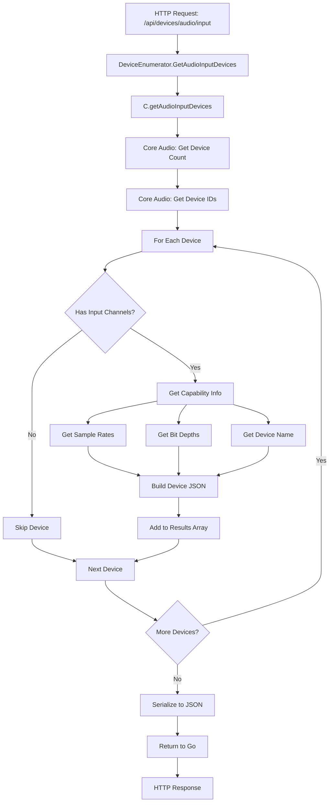
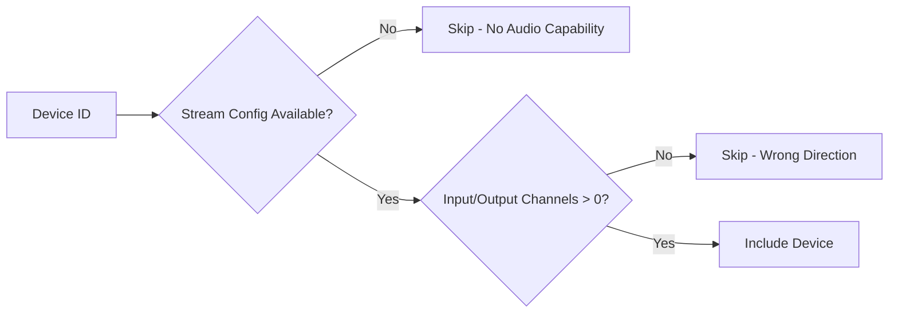
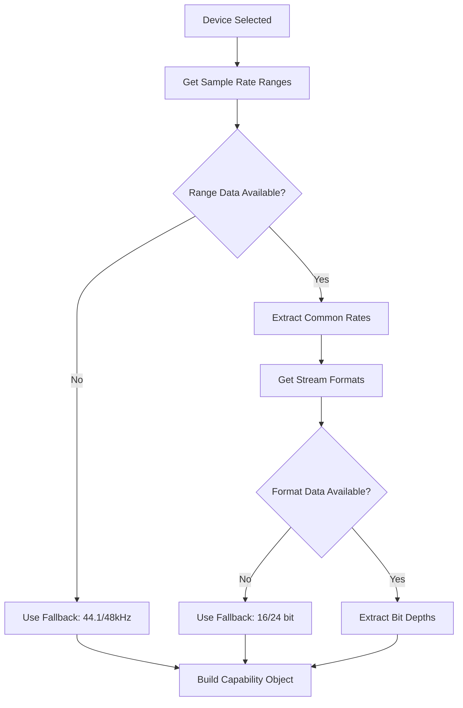
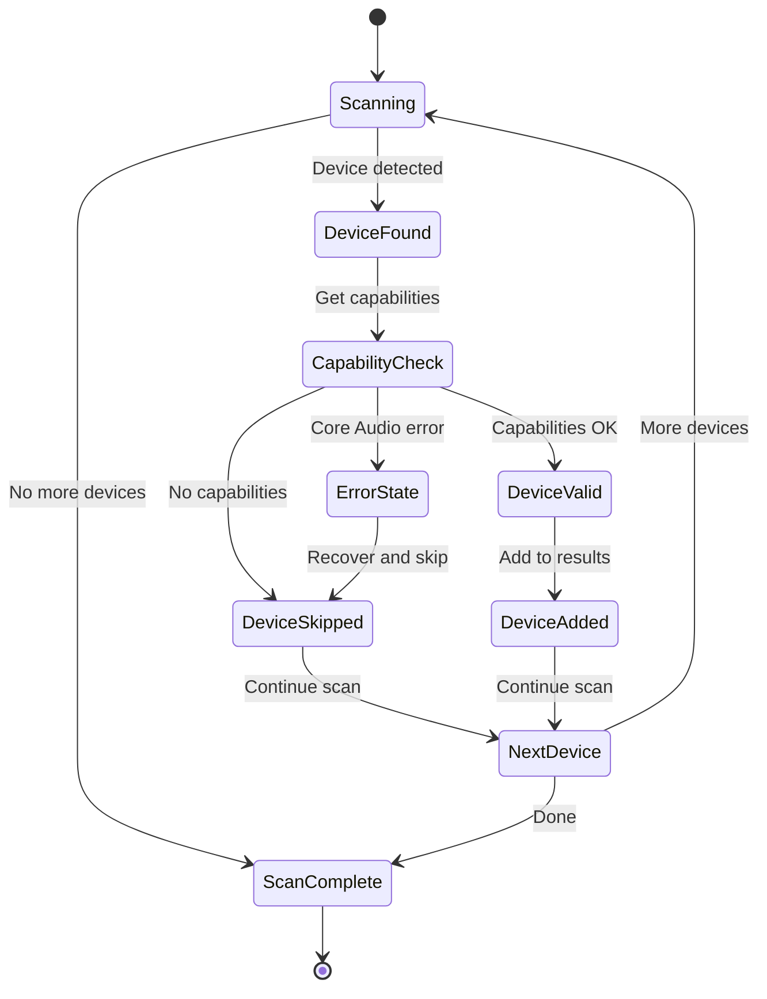

# Device Enumeration Flow

## Overview
This document maps the complete device discovery and capability detection process in MC-SoFX-Controller.

## Current Implementation Flow

## Key Decision Points

### 1. Device Filtering Logic

### 2. Capability Detection Strategy

## Error Handling States

## Current Issues & Improvements Needed

### ❌ Current Problems
1. **Default Device Detection**: Still hardcoded values
2. **Error Recovery**: Limited error handling for device failures
3. **Real-time Updates**: No device change notifications
4. **Validation**: No capability intersection checking

### ✅ Next Architecture Steps
1. **Default Device Flow**: Add real system default detection
2. **Device Compatibility Matrix**: Pre-compute valid device combinations
3. **Audio Chain Validation**: Check routing feasibility before AudioUnit load
4. **State Management**: Track device availability changes

## Testing Strategy

Each state transition should have corresponding tests:

- ✅ **Device Enumeration**: Test with known hardware configurations
- ✅ **Capability Detection**: Verify sample rates/bit depths match hardware specs  
- ⚠️ **Error Conditions**: Test device disconnection during enumeration
- ❌ **Default Device Logic**: Test system preference changes
- ❌ **Routing Validation**: Test incompatible device combinations

## Integration Points

This flow integrates with:
- **Frontend Device Selectors**: Populates dropdown lists
- **AudioUnit Host**: Provides constraints for audio processing
- **Preferences Manager**: Stores user device selections
- **Layout Manager**: Determines available I/O for plugin routing

---
*Last Updated: July 29, 2025*
*Implementation Status: Device enumeration ✅, Default detection ⚠️, Validation ❌*
