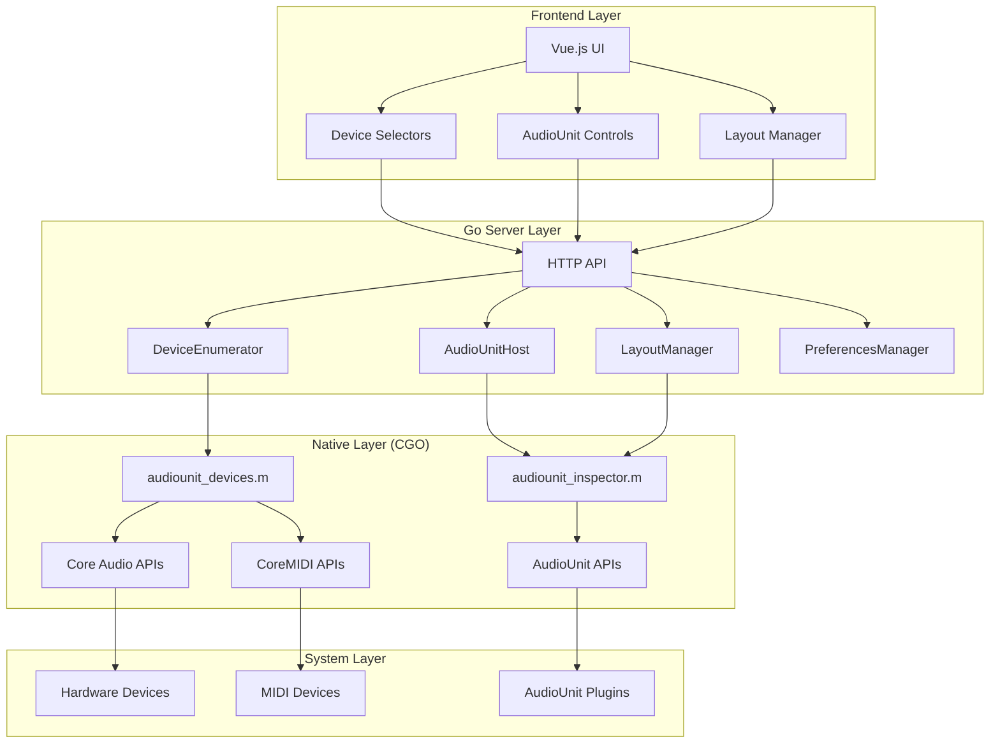
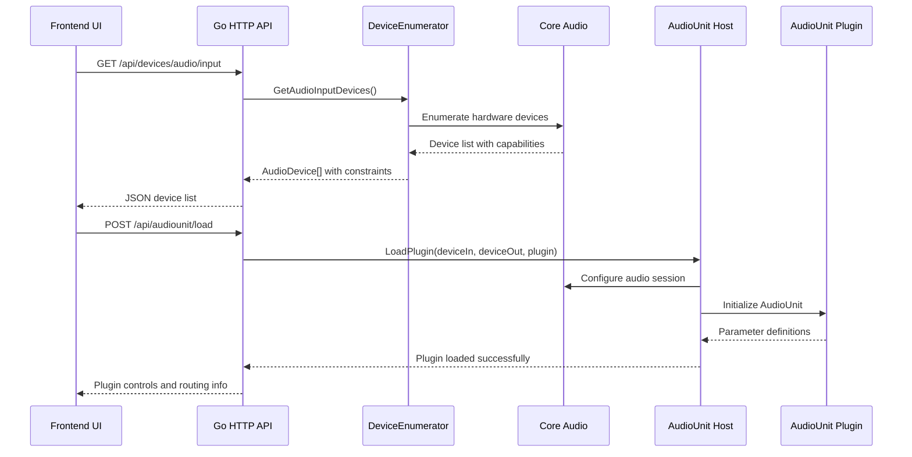
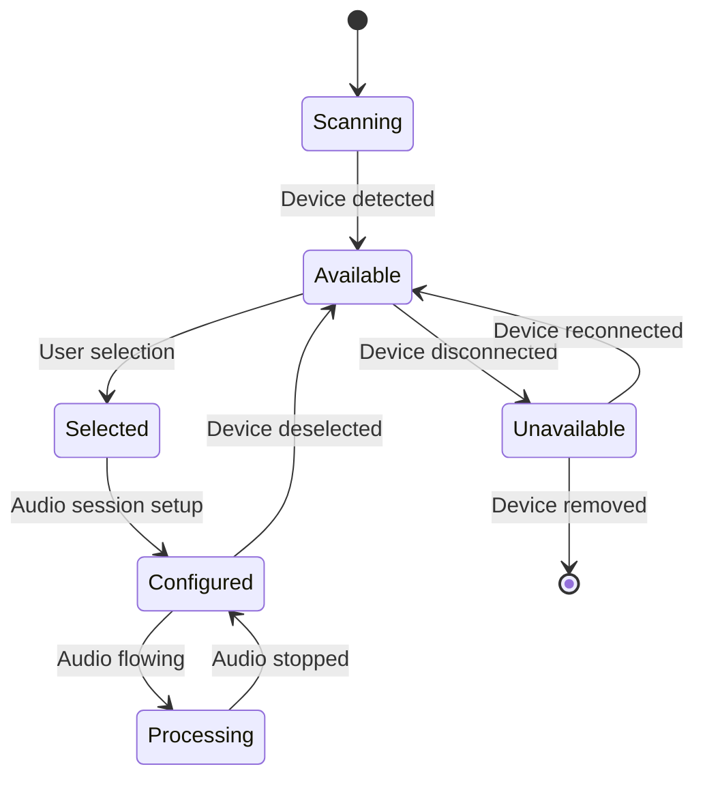
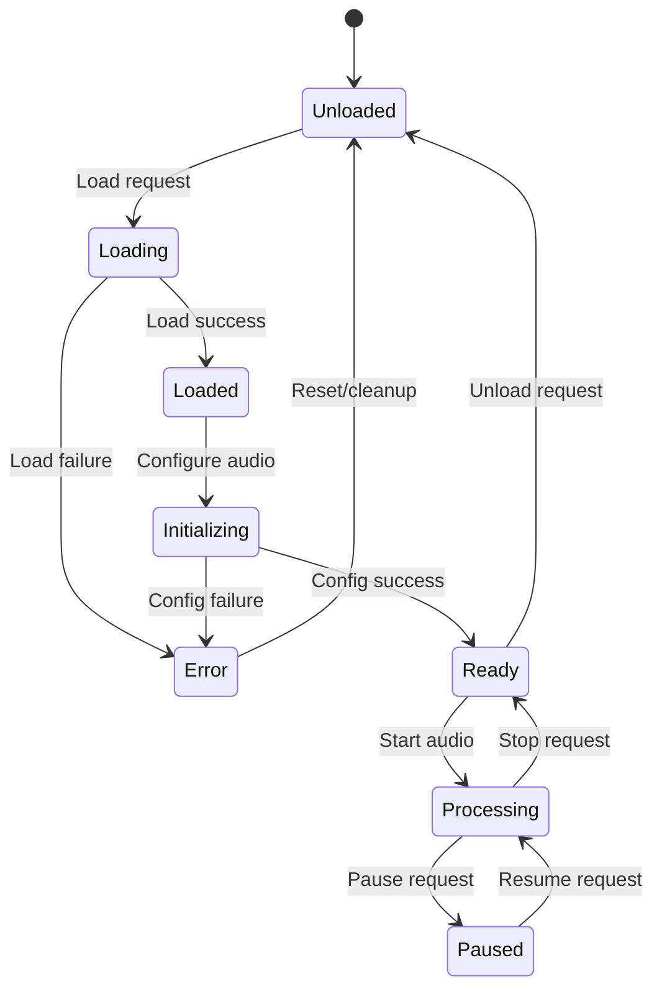

# MC-SoFX System Architecture

## System Overview

## Component Responsibilities

### Frontend Layer
- **Vue.js UI**: User interface and state management
- **Device Selectors**: Hardware device selection controls
- **AudioUnit Controls**: Plugin parameter manipulation
- **Layout Manager**: Control routing and organization

### Go Server Layer  
- **HTTP API**: RESTful endpoints for frontend communication
- **DeviceEnumerator**: Hardware device discovery and capability detection (main package functions)
- **AudioUnitHost**: Plugin instantiation and control (main package functions)
- **LayoutManager**: Control layout loading and management (main package functions)
- **PreferencesManager**: Application settings persistence (main package functions)
- **AudioUnitHost**: Plugin loading, configuration, and audio processing
- **LayoutManager**: Control layout generation and parameter mapping
- **PreferencesManager**: User settings persistence

### Native Layer (CGO)
- **audiounit_devices.m**: Core Audio and MIDI device enumeration
- **audiounit_inspector.m**: AudioUnit plugin introspection and hosting

### System Layer
- **Hardware Devices**: Audio interfaces, speakers, microphones
- **AudioUnit Plugins**: Third-party audio processing plugins
- **MIDI Devices**: Hardware and virtual MIDI controllers

## Data Flow Architecture

## State Management

### Device States

### AudioUnit States

## Key Architectural Decisions

### 1. **Modular CGO Architecture Pattern**
- **Decision**: Each Go source file has corresponding .h/.m pair with unified CGO imports
- **Structure**: 
  - `devices.go` → `audiounit_devices.h/.m` (device enumeration & Core Audio)
  - `introspection.go` → `audiounit_inspector.h/.m` (AudioUnit plugin discovery)
  - Shared CGO imports: `#cgo LDFLAGS: -framework CoreAudio -framework CoreMIDI -framework AudioToolbox`
- **Rationale**: Modular native code with consolidated framework linking prevents duplicate symbols
- **Trade-offs**: Multiple native files vs. single monolithic implementation

### 2. **Capability-First Device Enumeration**
- **Decision**: Detect device capabilities during initial enumeration
- **Rationale**: Enables intelligent routing decisions and prevents runtime errors
- **Trade-offs**: Slower initial scan vs. runtime capability checking

### 3. **JSON-Based CGO Interface**
- **Decision**: Pass complex data structures as JSON strings between Go and C
- **Rationale**: Avoids complex CGO type marshaling and memory management
- **Trade-offs**: JSON parsing overhead vs. direct memory access

### 4. **HTTP API for Frontend Communication**
- **Decision**: RESTful HTTP API instead of WebSocket for most operations  
- **Rationale**: Simpler debugging, standard tooling, request/response model
- **Trade-offs**: No real-time updates vs. implementation complexity

## Integration Points

### External Dependencies
- **Core Audio**: macOS system audio framework
- **AudioUnit**: macOS plugin architecture
- **CoreMIDI**: macOS MIDI framework
- **Vue.js**: Frontend reactive framework
- **Tailwind CSS**: UI styling framework

### Internal Interfaces
- **CGO Bridge**: Go ↔ Objective-C communication
- **HTTP API**: Frontend ↔ Backend communication  
- **JSON Schema**: Data structure contracts
- **File System**: Layout and preference persistence

## Future Architecture Considerations

### Scalability
- **Multi-plugin Support**: Simultaneous AudioUnit loading
- **Real-time Parameter Updates**: WebSocket or Server-Sent Events
- **Device Hot-swapping**: Dynamic device change handling

### Reliability  
- **Error Recovery**: Graceful plugin crash handling
- **State Persistence**: Crash recovery and session restoration
- **Resource Management**: Memory and CPU usage optimization

### Extensibility
- **Plugin Format Support**: VST3, CLAP support alongside AudioUnit
- **Cross-platform**: Windows WASAPI, Linux ALSA support
- **Remote Control**: Network-based control protocols

---
*Last Updated: July 29, 2025*
*Architecture Status: Foundation ✅, Device Layer ✅, AudioUnit Layer ⚠️*
